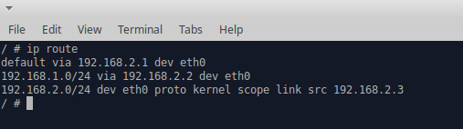

## Working environment

This lab consists in two networks, one for the OpenVPN client and the other one for the OpenVPN server. These two networks are linked between each other through a router.

Before proceeding with the set up of the vpn server it's worth saying that the default gateway of the OpenVPN client istance has been changed from 192.168.1.1 to 192.168.1.2 which is the address of the router container. Because of this change, the OpenVPN client is not able to access the public internet since the router container is not able to work as a NAT itself. However, as we'll see, once the client establishes the vpn connection with the server, it will be able to reach the public internet since it will use the openVPN server to forward all its requests.

As proof of what is written above, we can attach to the OpenVPN client/server shell and execute the two commands that follow :

<pre>
    $ ip route 
</pre>

which will show the routing table of the machine. If everything is ok, we should be able to see this line "default via 192.168.1.2 dev eth0" on client-side :

while on server-side :

 

and :
<pre>
$ ping 8.8.8.8 
</pre>

which will show no result if executed on the client, making us understand that is not possible for the OpenVPN client to reach the public internet .

 
## Server Setup

First of all we need to set up the OpenVPN server and in order to do so there are several scripts shipped with the given image.

Once attached to the OpenVPN Server shell, the steps we need to follow are :

### Generate the openvpn configuration files

<pre>
$ ovpn_genconfig -u udp://192.168.2.3
</pre>

This script generates both "openvpn.conf" and "ovpn_env.sh" configuration files and also does some iptables configuration. If you want to modify some configurations such as:
<ul>
    <li>listening port (default 1194) ;</li>
    <li>protocol (default udp) ;</li>
    <li>keepalive (default 10 - 60);</li>
    <li>device (tun or tap, default tun) ;</li>
    <li>etc.</li>
</ul>
you can also edit the "openvpn.conf" manually.

### Build a Certificate Authority and generate certificate and keys for the server

<pre>
$ ovpn_initpki
</pre>

This script :
<ul>
    <li>builds the CA;</li>
    <li>generates a certificate and a pair of keys (public and private) for the CA;</li>
    <li>generates a certificate and a pair of keys for the OpenVPN server ;</li>
    <li>generates the Diffie-Hellman parameters;</li>
    <li>generates a Certificate Revocation List file.</li>
</ul>
During the execution of this script you will be asked to insert a common name and a passphrase for the CA .

### Generate client certificate without a passphrase

<pre>
#Start the openvpn server process
$ ovpn_run --daemon
#Generate certificate
$ easyrsa build-client-full CLIENTNAME nopass
</pre>

### Generate client ovpn configuration file

<pre>
$ ovpn_getclient CLIENTNAME > CLIENTNAME.ovpn
$ cp CLIENTNAME.ovpn etc/openvpn
</pre>

This file will be saved into the "/home/user/dsp/NetworkSecurity_Unina/current_lab_folder/server/ovpn-data" folder of the host machine but it must be copied inside the "/home/user/dsp/NetworkSecurity_Unina/current_lab_folder/client/vpn_config" folder in order for the OpenVPN Client container to be able to use it. 

Once the easyrsa command is terminated, we have to kill the "ovpn_run" process we launched as a daemon, so we must first identify the PID of "ovpn_run" and then use it to kill the process :

<pre>
$ ps aux | grep ovpn_run
$ kill <ovpn_run_PID>
</pre>

This procedure is not mandatory for the correct functioning of the lab, however it's useful because the next time we'll execute the openvpn server process we'll do it without the daemon option so that we'll be able to see its output, in particular the output generated as consequence of the client connection.

## Client connection

Once the client ovpn configuration file is copied in the correct folder, we'll start again the openvpn server process without using the daemon option so that we can see its log on the shell:

<pre>
$ ovpn_run
</pre>

After starting the server we can attach to the Client shell and launch the following command in order to start negotiating the vpn session .

<pre>
$ openvpn --config /vpn/CLIENTNAME.ovpn --auth-nocache
</pre>

If everything goes fine we'll see this kind of output on client-side :

 

By reading this output we can understand that the subnet used to address the nodes inside the vpn is 192.168.255.0/24 (openvpn server default choice) and that the openvpn client got the address 192.168.255.6. Obviously, the private IP address of your vpn client most likely will be different from the one you'll see in this image.

Instead, on server-side we'll get this kind of output:

 

Now we can prove that the vpn connection has been created simply by executing this command

<pre>
$ ping 192.168.255.1 
</pre>

With this command we try to ping the server vpn private addres so we'll be able to reach this address only if we are part of that virtual private network .

The client is now connected to the VPN created by the server instance so all its requests will be forwarded using a secure channel (tunnel between the vpn client and the vpn server) to the vpn server which will act on its behalf. Since the OpenVPN Server istance has access to the public internet, the client too will be able to access it now.

Indeed, if we try to ping the usual google DNS server (8.8.8.8) we'll notice that the output is not empty.

As expected, both server and client will have their routing tables updated since they created/connected to a vpn, in particular on server-side :

 

while on client-side :

 
 
## Capture the packet sent during the vpn client connection

If you want to capture the packets sent/received from the server/client during the client vpn connection you can execute the following command on the router shell :

<pre>
$ tcpdump -i eth0 -w capture_eth0.pcap 
</pre>

Obviously, you'll not be able to decrypt most of the packets captured because the two entities (client and server) will encrypt them as soon as the chipher spec will be exchanged.